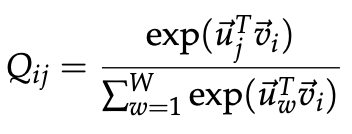

# Lecture 2：Word Vectors 2 and Word Senses
### Global Vectors for Word Representation
LSA、HAL等方法能有效地利用了全局的统计特征，主要捕获词语相似的地方。但是在推理、次优向量空间表现不太理想。 而shallow
window-based的方法，如skip-gram、CBOW，利用了固定窗口的信息，学习word
vector。在词语相似度方面表现不错，但缺少利用全局词语共现的统计信息。
GloVe由一个加权最小二乘模型组成，该模型训练全局词与词的共现计数，从而有效地利用统计数据。
最小二乘的目标：

损失函数为：

放宽到整个预料集：

上述公式中的Xij表现词i和词j的共现次数，而对于公式中的Q是需要标准化的，但是这样在真个预料集中花费大量的求和计算。
因此使用最小二乘的方法来替换：
但Xij通常是一个比较大的值，这使得优化变得十分困难。 因此对P和Q进行log转换：

另外，权重Xi不能保证一定是最佳的参数。 因此引入了更加通用、且可以自由选择所依赖上下文词语特征的权重函数：

### 怎么评估词向量的质量？
#### 内在方法：
* 应用在一个特殊/中间，子任务进行评估
* 模型是否足够快地训练完
* 对理解系统有帮助
* 除非与真正的任务建立联系，否则不知道是否有用

#### 外在方法：
* 在一个真实任务中进行评估
* 需要花费很长时间训练
* 不清楚是子系统的问题，还是它的交互作用，还是其他的子系统
* 如果用一个子系统替换了另外一个子系统，导致了模型acc有提高

##### 内在方法评估例子：词向量推理
使用cosine similarity的方法进行计算，例如queen-king=actress-actor。使用一下公式来计算两个单词之间的相似度。

推理规则：A:b::c:?
  
语义词向量=》Chicago : Illinois : : Houston : Texas

语义词向量=》Abuja : Nigeria : : Accra : Ghana

语法词向量=》bad : worst : : big : biggest

##### 内在方法评估微调例子：类比评估
通过调节word vector embedding的超参，来看看其实怎么影响vector的质量
结论：
* 推理任务表现强依赖与word embedding的模型
* 大语料会提高模型表现
* word vector的维度越低，模型表现越差

##### 内在方法评估例子：相关性评估
人工在一个固定的单词上评估两个单词之间的相似性标度(比如0-10)，同时使用余弦相似度进行计算比较。在多个数据集上进行测试。
若人类标注的分数与cosine计算的分数相似，那么可认为模型时有效的。

##### Training for Extrinsic Tasks
一般的word embedding都是会被应用到其他下游的任务，这里我们按照这个思路来分析。

###### retraining word vector
图1是使用预训练好的word embedding做词分类时的效果，而图2是对word embedding进行retrain后的词分类效果。相对而言效果变差了。
* 如果retrain数据集太小，那word vector不应该被训练。有可能会导致原始的word vector发生改变，甚至减低原始vector的效果。
* 如果retrain数据集太大，那word vector可以再训练。

###### Window Classification

窗口小的情况下，模型在句法测试表现较好

窗口大的情况下，模型在语义测试表现较
